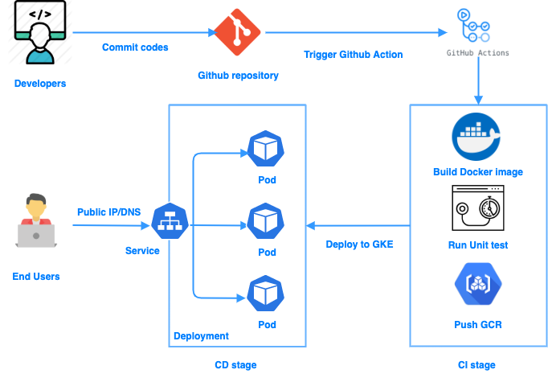
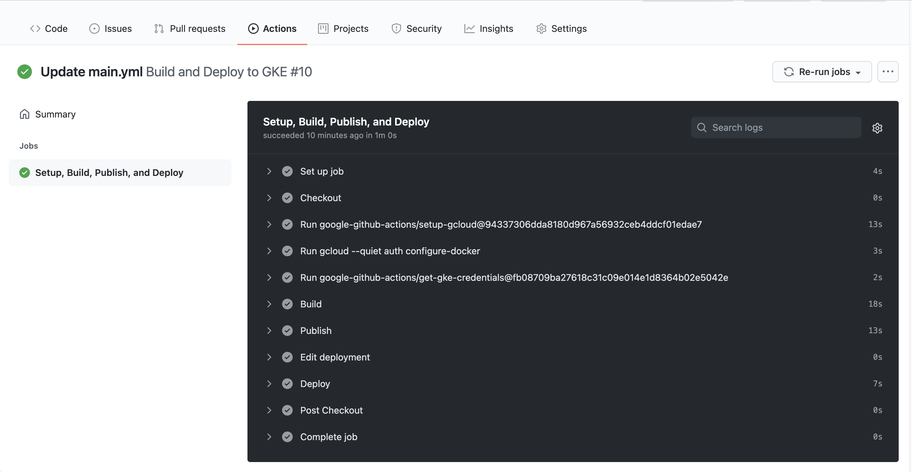
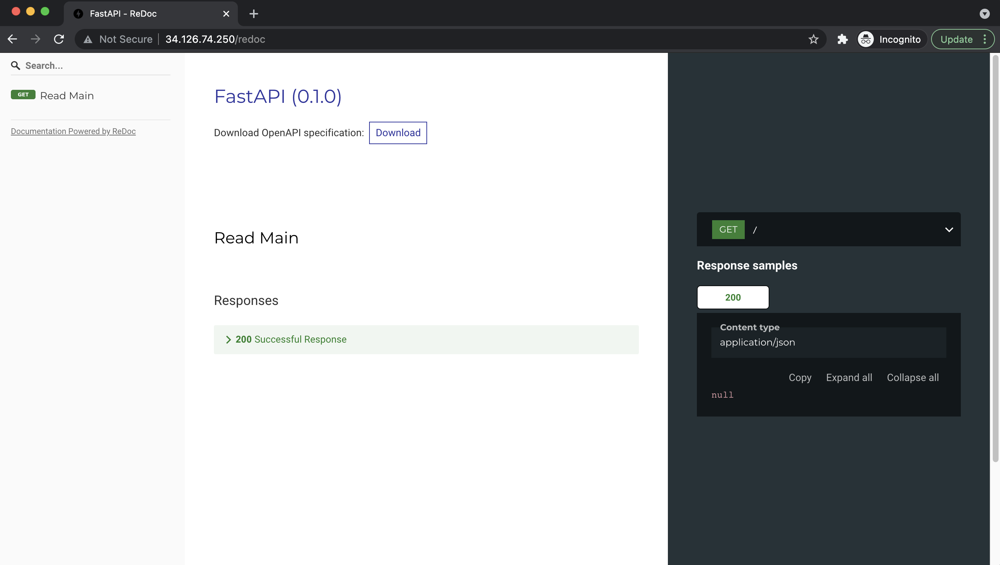

# Simple Application with Github Action CI/CD

## Description
This project stimulates a simple GitOps strategy which will deploy a simple application which run FastAPI to GKE cluster using Github Action as CI/CD tool
## Architecture

## Workflow
The workflow of this project has 3 stages:
### Development
Developers and DevOps engineers update the code and create PR to `main` branch, then after the reviews and approvals, the PR will be merged and trigger the pipeline on Github Action
### CI
[Github Action manifest](./.github/workflows/main.yml) will do 4 steps:
- Build Docker image
- Run unit test 
- Push Docker image to GCR
- Deploy to GKE cluster

### CD
Using `kubectl` to deploy to GKE cluster which has 1 LoadBalancer service to access application from Internet

## Note
The project is for demo purpose so after testing, I delete the GKE cluster to reduce the cost. If you want to know detail about the project, please contact me via [here](https://github.com/lecongbang314/)
